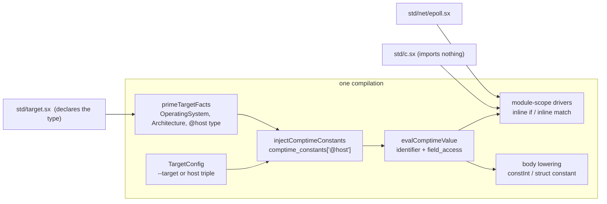
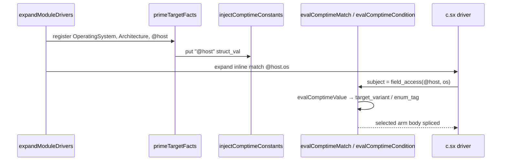

# `@host` — one comptime struct of target facts

| | |
|---|---|
| **Author** | — |
| **Date** | 2026-08-29 |
| **Status** | Draft |
| **Repo** | `/Users/agra/projects/sx` |
| **Gate** | `zig build test` |

---

## Overview

Target facts are three compiler-injected bare identifiers — `OS`, `ARCH`, `POINTER_SIZE` — stuffed into `Lowering.comptime_constants` by `injectComptimeConstants` (`src/ir/lower/decl.zig`). They are the only compiler facts that are not `@` contracts. Stdlib platform prune (`inline if OS == .linux`, `inline match OS { case .macos: … }`) and the expander (`src/ir/lower/expand.zig`) depend on them; specs.md still claims they come from `modules/build.sx`.

This design replaces those three magic names with one compiler-formed comptime value, `@host`, whose *type* is a declared `@` contract in the already-dependency-free `library/modules/std/target.sx`, and whose *value* the compiler fills from `TargetConfig` (the `--target` triple, or the host triple when `--target` is omitted). User code reads fields:

```sx
inline if @host.os == .macos { … }
inline match @host.os {
    case .linux: …;
    else: @error("unsupported target");
}
inline if @host.pointerSize == 8 { … }
inline if @host.os == .ios and @host.isSimulator { … }
```

The implementation kernel is not a per-site special case for the spelling `@host`. It is: **a comptime constant may be a struct, and `inline if` / `inline match` / the integer folder evaluate a field-access whose object is such a constant.** `@host` is the one such constant the compiler injects. `OS` / `ARCH` / `POINTER_SIZE` are deleted with no shims; every in-repo caller migrates in the cut.

The same language-surface cut camelCases every **sx-authored** identifier in the stdlib, corpus, specs, and language contracts (`@isComptime`, `addLinkFlag`, `pathJoin`, …). Imported C/ObjC/JNI symbol spellings, `__sx_*` ABI, and Zig internals stay. No dual spelling: each name’s old form is gone in the PR that introduces the new form.

---

## Background & Motivation

### What exists

`library/modules/std/target.sx` is dependency-free (imports nothing). It declares:

```sx
OperatingSystem :: enum { macos; linux; windows; wasm; ios; android; unknown; }
Architecture    :: enum { aarch64; x86_64; wasm32; wasm64; unknown; }

OS : OperatingSystem = .unknown;
ARCH : Architecture = .unknown;
POINTER_SIZE : i64 = 8;
```

The dummy values exist so the names are declared. `injectComptimeConstants` overwrites the facts from `TargetConfig`:

| name | mapping | `ComptimeValue` |
|---|---|---|
| `OS` | wasm / windows / android / linux / ios / macos / unknown (android before linux) | `.enum_tag` if `OperatingSystem` is in the type table, else `.target_variant` (name only) |
| `ARCH` | wasm32 / wasm64 / aarch64 / x86_64 / unknown | same, against `Architecture` |
| `POINTER_SIZE` | `4` if `tc.isWasm32()`, else `8` | `.int_val` |

`putTargetConstant` is why `inline if OS == .macos` works in modules that do **not** import `target.sx` (e.g. `library/modules/std/c.sx`, `library/modules/std/net/epoll.sx`). Importing the enum from inside the arm that selects the backend would be circular. The expander primes the two enum types then injects the constants *before* any module-scope driver folds (`primeTargetFacts` in `src/ir/lower/expand.zig`).

Folding itself is identifier-shaped:

- `evalComptimeCondition` (`src/ir/lower/comptime.zig`): `==` / `!=` LHS **must** be an identifier in `comptime_constants`.
- `evalComptimeMatch`: subject **must** be an identifier in `comptime_constants`.
- `driveCondition` in the expander: a `field_access` condition is a *namespace member* (`driveQualifiedCondition`), not a comptime field.

Runtime reads go through `lowerExpr`'s identifier arm (`src/ir/lower/expr.zig`): `.int_val` / `.enum_tag` become `constInt`; `.target_variant` has no runtime reading and falls through to the ordinary unresolved-name path.

`build.sx` flat-imports `target.sx` so the enums stay in the standard import graph. That import is **not** a re-export (flat import does not propagate). Specs.md §8 "Compiler Constants" (~5833) still says `modules/build.sx` provides `OS` / `ARCH` / `POINTER_SIZE` and omits `.ios` / `.android` / `.wasm64`.

### Why change it

- Bare `OS` is the outlier: a compiler fact that is not an `@` contract. The `@` namespace (`src/contracts.zig`) is the compiler-maintained surface; `@sizeOf`, `@SourceSite`, `@is_comptime` already live there. Target facts belong with them.
- Three names, three injections, three dummy decls, for one idea: "what are we compiling for."
- The fold cannot see `@host.os` until the identifier restriction is lifted. That restriction is the actual work; renaming the facts without lifting it would not compile the stdlib.

### Inventory: magic identifiers vs `@` contracts

**Two kernels, one language cut.** Target facts fold into `@host`. Sx-authored snake_case identifiers camelCase. Adjacent leftovers of those classes (stale specs citation, expander comments, dummy decls, snake_case in `library/` / `examples/` / specs) travel with the cut. JNI/ObjC/Swift heads, `@OpenSet`, `context`, and C symbol strings do not.

| Surface | Class | Action |
|---|---|---|
| `OS`, `ARCH`, `POINTER_SIZE` | Compiler-injected bare identifiers; values in `comptime_constants` | Fold into `@host` |
| `OperatingSystem`, `Architecture` | Ordinary enums in `std/target.sx` | Keep, as `@host` field types |
| `@sizeOf`, `@typeOf`, `@typeInfo`, `@alignOf`, `@printf`, `@isComptime`, `@panic`, `@error`, `@volatileLoad`, `@vaStart`, `@envType`, `@callPtr`, `@len`, `@field`, … | Declared `@` functions; identity is `(module, name)` in `contracts.zig` **and** `src/ir/intrinsics.zig` | Snake_case `@` names camelCase (mapping below). Already-camelCase names stay. `@host` is **not** a function and does **not** join the intrinsic registry |
| `@SourceSite`, `@BuildShape`, `@VaList`, `@Slice`, `@Closure`, `@Protocol`, `@Any` | Declared `@` struct types; compiler recognizes by `(module, name)` and, for structs, field shape | `@host` joins this class as a declared struct. Snake_case **fields** camelCase (`fnPtr`, `typeId`, `staticExpressions`, …) |
| `@Vector`, `@Array`, `@int`, `@Init`, `@BuildBlock` | `kind = .compiler_formed` — declaring the name is an error | `@host` is **not** this. `@host()` is wrong |
| `@OpenSet`, `@OpenVariant`, `@JniClass`, `@ObjcClass`, `@SwiftClass`, `@ObjcCall`, … | Declaration forms / FFI heads (`contracts.zig` `*_head` constants) | Untouched (already PascalCase heads) |
| Lexer directives (`@run`, `@import`, `@insert`, `@library`, `@context.extend`, …) | Dedicated token tags | `@context.extend` is the string the lexer matches. Other directive spellings stay |
| `@caller` | Param-default marker that materializes a `@SourceSite` | Untouched |
| `context` | Implicit `*Context` load in `lowerExpr` | Different class. Not a target fact. Spelling stays |
| `string`, `Type`, `isize`, `usize`, integer aliases | Language primitives (`type_resolver`) | Untouched. `isize`/`usize` already *are* pointer-width integers; `@host.pointerSize` is the byte width |

`epoll.sx` still says a top-level `inline if OS` is resolved by "the compiler's flatten pre-pass (`imports.zig`)". That is already false: import resolution leaves drivers opaque; `expandModuleDrivers` owns the fold. The comments in `target.sx` / `c.sx` / `build.sx` / `epoll.sx` are rewritten in the cut to state the present `@host` rule, with no historical framing.

---

## Goals & Non-Goals

### Goals

- One comptime value `@host` of a declared struct type, fields `os`, `arch`, `pointerSize`, `isSimulator`.
- Cut `OS`, `ARCH`, `POINTER_SIZE` as names. No deprecation aliases, recognize-and-hint arms, or fallbacks. The old spelling fails through the ordinary unresolved-identifier path.
- `inline if @host.os == .macos` and `inline match @host.os { case .macos: … }` fold at the same choke-points that fold `OS` today, including in modules that import nothing.
- `@host` is a declared `@` contract (`contracts.zig` + `std/target.sx`). Changing fields is a coordinated compiler + stdlib revision.
- Runtime-readable when the type is in the program, matching `OS` / `POINTER_SIZE` today.
- CamelCase every sx-authored identifier in stdlib, corpus, specs, and language contracts. Completeness is `rg`. Gate: `zig build test`.

### Non-Goals

- Renaming already-camelCase `@` functions (`@sizeOf`, `@typeOf`, …), JNI/ObjC/Swift heads, `@OpenSet`, or the `context` identifier.
- A `@host()` type constructor or 0-arg function.
- Feature flags, a dual-spelling language (`OS` and `@host`, or `path_join` and `pathJoin`), a dual-spelling corpus, or a migration warning. Old names may still inject on an unmerged kernel stack so that PR stays green; they do not ship as a released surface.
- Padding `@host` with endian, ABI/env, object format, pointer *bit* width, or Emscripten-as-OS. Those have no sx caller (and endian / ABI are not `TargetConfig` fields).
- Splitting `.ios` into device vs simulator OS tags.
- Making `@host` comptime-illegal in runtime value position.
- Corollary tests that restated "the fold works for every OS arm" or "every helper is camelCase."
- Renaming imported C/ObjC/JNI **symbol** strings, `__sx_*` ABI, compiler-generated pack names, ALL_CAPS C flags, or Zig identifiers except the sx-spelling **strings** in `contracts.zig` / `intrinsics.zig` / lexer match tables.

---

## Key Decisions

1. **`@host` is a declared struct contract and a compiler-formed singleton of that type.** The stdlib writes `@host :: struct { … }` in `std/target.sx`. The compiler injects the value under the same `@` name into `comptime_constants`. Type position sees the struct; value position sees the singleton. `@host()` is an ordinary "not a function" error — no dedicated diagnostic.

2. **Field types stay the named enums `OperatingSystem` / `Architecture`, not nested anonymous enums.** They already exist, `fieldTypeMatches` already accepts a `type_expr` spelling, and a function can take `os: OperatingSystem`. Nested anonymous enums would need a shape-checker extension and would be unnameable in signatures.

3. **camelCase is the identifier convention for sx-authored names** in stdlib, corpus, specs, and language contracts. Field names, function names, comptime-const fields, `@` function names, contract struct fields, and example-local identifiers are camelCase (`pointerSize`, `isSimulator`, `@isComptime`, `addLinkFlag`, `pathJoin`). Type names stay PascalCase (`OperatingSystem`, `Architecture`). Enum variants stay lower/dot identifiers (`.macos`, `.x86_64`). Already-camelCase `@` functions stay (`@sizeOf`, `@typeOf`, `@errorName`). Foreign C/ObjC/JNI **imported symbol spellings** stay as the C name. `__sx_*` compiler ABI stays. Zig compiler internals stay snake_case (Zig). Completeness for sx names is `rg` of snake_case identifiers in `.sx` / `specs.md` / `docs`, minus those exclusions.

4. **`pointerSize` is a stored `i64` byte width** (`4` on wasm32, `8` otherwise — the current `POINTER_SIZE` rule). Not `u8` (comptime ints and `@sizeOf` are `i64`). Not derived from `@sizeOf(*void)`: expansion must fold before layout exists. `isize` / `usize` remain the pointer-width *integer types*; they are not a substitute for the byte count.

5. **`isSimulator: bool` is the iOS device/sim split.** `.ios` stays one OS tag. The bool is `TargetConfig.isIOSSimulator()` (triple contains `"simulator"`). False on every non-iOS target, including macOS. Bundler code that already calls `BuildOptions.isIosSimulator()` is a different surface (build-script API) and is not rewritten onto `@host`.

6. **No other fields.** Endian, ABI/env, object format, pointer bit width, `isEmscripten`, `vaListWords` stay out. Add a field when it has an sx caller or a `TargetConfig` source *and* a reason the expander must see it without layout.

7. **Runtime-readable, not comptime-only.** `print("{}", @host.pointerSize)` and `if @host.pointerSize == 8 then …` (non-`inline`) keep working, as `POINTER_SIZE` does in `examples/comptime/0609-comptime-inline-if.sx` and `examples/platform/1604-platform-build-config.sx`. Enum fields need the enum type in the program (today's `.enum_tag` vs `.target_variant` split). The whole struct as a value needs the `@host` type in the program.

8. **The fold generalization is the kernel; `@host` is the one injected struct.** `evalComptimeCondition` / `evalComptimeMatch` stop requiring a bare identifier. They evaluate a small comptime-value language: identifier in `comptime_constants`, then field projection. A `.bool_val` participates in `not` / `and` / `or` the same way a bool literal does (`inline if !@host.isSimulator`). No per-site `@host` matcher.

9. **Home is `std/target.sx`, not `std/core.sx`.** `core.sx` imports `c.sx`. `c.sx` is the lowest libc surface and must keep importing nothing. Target enums and `@host` stay in the dependency-free module they already occupy. `contracts.zig` records `module = "modules/std/target.sx"`.

10. **No shims. Migrate and cut are one language change per name.** A kernel PR may still put the old target-fact names so it is green on its own; that coexistence is an unmerged stack detail, not a released two-spelling language. The PR that publishes `@host` migrates every in-repo `OS` / `ARCH` / `POINTER_SIZE` caller and deletes those names. The PR that publishes a camelCase spelling deletes the snake_case form in the same change. No alias, no hint arm.

---

## Proposed Design

### Language spelling

```sx
// library/modules/std/target.sx — imports nothing
OperatingSystem :: enum { macos; linux; windows; wasm; ios; android; unknown; }
Architecture    :: enum { aarch64; x86_64; wasm32; wasm64; unknown; }

@host :: struct {
    os: OperatingSystem;
    arch: Architecture;
    pointerSize: i64;
    isSimulator: bool;
}
```

No dummy `OS` / `ARCH` / `POINTER_SIZE` values. The compiler forms the `@host` value; the declaration is the type.

User code, no import required for folding or for a runtime int/bool field:

```sx
inline if @host.os == .linux or @host.os == .android { … }

inline match @host.os {
    case .macos:  errno_location :: () -> *i32 extern libc "__error";
    case .ios:    errno_location :: () -> *i32 extern libc "__error";
    case .linux:  errno_location :: () -> *i32 extern libc "__errno_location";
    case .android: errno_location :: () -> *i32 extern libc "__errno";
    case .windows: errno_location :: () -> *i32 extern libc "_errno";
    case .wasm:   errno_location :: () -> *i32 extern libc "__errno_location";
    else:         @error("errno_location: unsupported target");
}

inline if ARCH == .x86_64 { … }          // gone
inline if @host.arch == .x86_64 { … }    // replacement (epoll packed layout)

inline match POINTER_SIZE { case 4: …; case 8: …; }   // gone
inline match @host.pointerSize { case 4: …; case 8: …; }

ps := if @host.pointerSize == 8 then "8" else "4";   // runtime const, as today
```

Naming the *types* (`OperatingSystem`, `Architecture`, `@host` as a type) still means importing `std/target.sx` — or relying on it being in the program (build.sx's flat import keeps it in the standard graph). `@` contract types also resolve program-wide once declared (`selectNominalLeaf` in `src/ir/lower/decl.zig`), the same rule as `@SourceSite`.

`@host` is **not** an intrinsic. It does not appear in `src/ir/intrinsics.zig`. It is a declared struct contract plus a compiler-injected value.

### Contract registry

Add to `src/contracts.zig` `entries`, next to the other declared structs:

```zig
.{
    .name = "@host",
    .module = "modules/std/target.sx",
    .fields = &.{
        .{ .name = "os",            .type_name = "OperatingSystem" },
        .{ .name = "arch",          .type_name = "Architecture" },
        .{ .name = "pointerSize",  .type_name = "i64" },
        .{ .name = "isSimulator",  .type_name = "bool" },
    },
},
```

`checkContractShape` already matches `type_expr` names (`fieldTypeMatches`), so `OperatingSystem` / `Architecture` work without a shape-checker extension. The comment on `Field` that says "a contract's fields are primitives" is no longer the whole truth — the spelling *is* still the whole check; update that sentence when the entry lands.

A `contracts.zig` test locks the four fields in order, the same way `the @SourceSite shape is the one lowering builds` locks `@SourceSite`. Variant lists of the two enums are *not* duplicated into `contracts.zig`; the enums in `target.sx` plus the mapping in `injectComptimeConstants` are the lock.

`semantic_diagnostics` already refuses a user `@host` declaration outside the owning module, and refuses an unknown `@` name as a declaration. No new diagnostic class.

### Value formation

`injectComptimeConstants` (`src/ir/lower/decl.zig`) injects **one** entry, key `"@host"`. OS / arch variant strings stay exactly the current `TargetConfig` cascade (android before linux; wasm before windows; iOS before macOS). `pointerSize` stays `if (tc.isWasm32()) 4 else 8`. `isSimulator` is `tc.isIOSSimulator()`.

Do **not** write `&.{ runtime_value }`. `os_cv` / `arch_cv` are computed from `TargetConfig`; a slice of statement-local temporaries stored in `comptime_constants` is use-after-return. Today’s injection never allocates (`enum_tag`, a binary-resident `[]const u8` variant name, an `i64`). The struct is a new heap shape:

```zig
const fields = self.alloc.alloc(ComptimeValue.Field, 4) catch return;
fields[0] = .{ .name = "os",           .value = os_cv };
fields[1] = .{ .name = "arch",         .value = arch_cv };
fields[2] = .{ .name = "pointerSize", .value = .{ .int_val = ptr_size } };
fields[3] = .{ .name = "isSimulator", .value = .{ .bool_val = tc.isIOSSimulator() } };
self.comptime_constants.put("@host", .{ .struct_val = fields }) catch {};
```

Allocate on `self.alloc` (the lowering arena, same as other IR facts) **before** `put`. Field `name` strings are literals. `ComptimeValue.Field.value: ComptimeValue` is intentionally recursive through a slice, so the union stays well-formed (no inline recursive union).

`putTargetConstant`'s enum-or-variant choice is reused per enum field: if `OperatingSystem` / `Architecture` are already registered, store `.enum_tag`; otherwise `.target_variant`. That is the circular-import hatch, unchanged in meaning.

`target_config == null` still no-ops the injection (same as today). Production compilations always have a `TargetConfig` (`src/core.zig`).

A kernel-only stack may still also put `OS` / `ARCH` / `POINTER_SIZE` so that PR is green alone. That is not the language: the migrate+cut PR removes those puts and the dummy decls in the same change as the callers.

### `ComptimeValue`: structs and bools

Today (`src/ir/lower.zig`):

```zig
pub const ComptimeValue = union(enum) {
    int_val: i64,
    enum_tag: struct { ty: TypeId, tag: u32 },
    target_variant: []const u8,
};
```

Extend:

```zig
pub const ComptimeValue = union(enum) {
    int_val: i64,
    bool_val: bool,
    enum_tag: struct { ty: TypeId, tag: u32 },
    target_variant: []const u8,
    struct_val: []const Field,

    pub const Field = struct {
        name: []const u8,
        value: ComptimeValue,
    };
};
```

Zig exhaustiveness forces every `switch (cv)` to take the new arms. Known sites: `evalComptimeCondition`, `evalComptimeMatch`, `lowerExpr` identifier arm, `comptimeIntNamed`, `pack.zig` `comptimeIndexOf`. `.struct_val` / `.bool_val` are not integers; those integer helpers return null for them. `inline for` cursors keep storing `.int_val` and are unaffected.

Do **not** add a `.host`-specific tag. `@host` is one `struct_val`.

### Choke-point: `evalComptimeValue`

Add `evalComptimeValue(self, node) ?ComptimeValue` in `src/ir/lower/comptime.zig`. It is the only projector.

```
evalComptimeValue(node):
    identifier        → comptime_constants.get(name)
    field_access      → evalComptimeValue(object), then the named field
                        of a .struct_val (unknown field → null; the
                        caller that saw .struct_val must not treat this
                        as a namespace)
    otherwise         → null
```

That is the whole language. No arithmetic, no calls, no nested namespace walk. Nested field access falls out of recursion; `@host` is one level deep and we do not add a nested-of-nested keep-test. An unknown field on a `.struct_val` returns null; the *caller* that already saw `.struct_val` must not then treat the access as a namespace (expander glue below).

**`evalComptimeCondition`** (binary `==` / `!=`): evaluate the LHS with `evalComptimeValue` instead of "must be an identifier." Compare against the RHS:

| LHS `ComptimeValue` | RHS AST | comparison |
|---|---|---|
| `.enum_tag` | `.enum_literal` | tag index vs variant index (today) |
| `.target_variant` | `.enum_literal` | string eq (today) |
| `.int_val` | int/char literal | integer eq (today) |
| `.bool_val` | `.bool_literal` | bool eq |

A bare identifier that names a *module const* (`ENABLED :: false`, `NATIVE :: @host.pointerSize == 8`) still recurses through `module_const_map` — that arm stays. `F :: OS == .ios` becomes `F :: @host.os == .ios`; the expander already drives the const's RHS.

A bool-valued *whole condition* (`inline if @host.isSimulator`) is `evalComptimeValue` → `.bool_val`. Wire that in `evalComptimeCondition`'s identifier / field_access arms.

**`not` / `and` / `or`.** Live `evalComptimeConditionDepth` (`src/ir/lower/comptime.zig` ~230) has no `.unary_op` arm (`else => return null`). Module-scope `driveCondition` already handles `.not` by recursing; in-function `inline if` goes only through `evalComptimeCondition` (`control_flow.zig` ~301) and, on null, falls through to runtime — both branches type-check. `inline if !@host.isSimulator` is the spelling; without `.unary_op .not` it would not prune in function bodies, and dead-arm types would error on the other target.

Add `.unary_op .not` to `evalComptimeConditionDepth`: recurse, invert. Keep `and` / `or` as they are — they already recurse and pick up field-access bools once that arm exists. This is the bool-condition kernel, not a catalog: a `.bool_val` from `evalComptimeValue` participates in `not` / `and` / `or` the same way a bool literal and a module const do. Pin the fork once in the PR 1 example (`inline if !@host.isSimulator`), not a permutation matrix.

**`evalComptimeMatch`**: `evalComptimeValue(me.subject)` instead of "subject must be an identifier." The existing `.enum_tag` / `.int_val` / `.target_variant` arm matching is unchanged; it just consumes a value rather than a name. `.bool_val` matching is not required for the stdlib (`isSimulator` is used with `inline if`); do not add a bool-match catalog.

A `.struct_val` subject returns null (do not write `inline match @host`). Those two null paths are **not** the same:

- Module-scope (`expandDriverBody` ~972): `evalComptimeMatch(&me) orelse return true` — no diagnostic, no splice. The driver's declarations vanish. This is pre-existing; this work does not add a match-unfoldable diagnostic. `inline match @host.os` **must** fold via `evalComptimeValue`; if it does not, `c.sx`'s errno table disappears with no error.
- In-function (`lowerMatch` ~1187): null falls through to runtime match.

Do not describe a failed module-scope `inline match` as the inline-if unfoldable diagnostic.

### Expander glue

`driveCondition` (`src/ir/lower/expand.zig` ~670) currently sends **every** `field_access` to `driveQualifiedCondition`. That is correct for `inline if ns.FLAG`. It is the wrong *class* of failure for `@host.*`.

`qualifiedMemberVerdictFrom("@host.isSimulator")` sees root `"@host"`, which is not a namespace alias, so it returns `.not_qualified` (not `.missing`). `foldCondition` then treats a null with no `awaited` as unfoldable and emits `cannot evaluate this module-scope \`inline if\` condition; it must fold to a compile-time constant`. It does **not** park. Parking would only happen if `@host` were a namespace alias.

Field-access is one kernel, not “try bool, else namespace”:

1. `evalComptimeValue(object)`.
2. If that is `.struct_val`, this is **not** a namespace. Project the field:
   - missing field → unfoldable (null, no `awaited`; module-scope `inline if` takes the existing unfoldable diagnostic). Do not invent a dedicated “no such `@host` field” diagnostic.
   - `.bool_val` → that bool (`inline if @host.isSimulator`).
   - any other field kind (`inline if @host.os`) → not a condition, unfoldable. Same as today’s `inline if OS` without a comparison — acceptable, stated here once.
   Do **not** call `driveQualifiedCondition`.
3. If the object is not a comptime struct, `driveQualifiedCondition` (today’s `inline if ns.FLAG`).

`inline if @host.os == .macos` never hits this arm: it is a `.binary_op`, which already calls `evalComptimeCondition`.

`primeTargetFacts` / `registerTargetEnums`: keep priming `OperatingSystem` and `Architecture`. Also prime the `@host` struct (`registerStructDecl` on the `.struct_decl` named `@host` — `Name :: struct` is a `.struct_decl`, not a wrapping `.const_decl`). Rename the helper to something that is not enum-only (`registerTargetDecls`). The name set is `OperatingSystem`, `Architecture`, `@host` — not every decl in `target.sx`.

`registerStructDecl` resolves field types when it runs. `@host`’s fields name `OperatingSystem` and `Architecture`. **One walk, file order:** `target.sx` declares the enums first, then `@host`. `internNamedTypeDecl` is idempotent per `decl_key`, so priming then scanning again is safe. Do not register `@host` in a first pass and the enums in a second — field types would become unresolved stubs. Two explicit passes (enums, then `@host`) are also fine; a name-sorted walk is not.

### Integer folder (array dims, `inline for` bounds)

`evalConstIntExpr` (`src/ir/program_index.zig`) is the shared integer folder for array dimensions, `@Vector` lanes, generic value-param counts, and `inline for` bounds. Identifier leaves go through `ctx.lookupDimName`; on `*Lowering` that is `comptimeIntNamed`, which already reads `.int_val` out of `comptime_constants`. Field-access leaves go through `ctx.lookupConstStructField(name, field, span)`. Two ctxs matter:

- `*Lowering` (`evalComptimeInt` ~473): `Lowering.lookupConstStructField` (`lower.zig` ~1821).
- `SourceConstCtx` (`foldSourceConstInt` ~1958, and `foldConstStructField` itself): `SourceConstCtx.lookupConstStructField` (`lower.zig` ~201) currently calls `foldConstStructField` **directly**.

`foldConstStructField` (`comptime.zig` ~2212) only folds a **module const** whose RHS is a `struct_literal`. `@host` is not that.

The probe is **name + field**, not a node: `comptime_constants.get(name)` as `.struct_val`, then the named field as `.int_val`. Do not synthesize an AST node for `evalComptimeValue`. Then the module-const `struct_literal` path. Direct `[@host.pointerSize]T` / `inline for 0..@host.pointerSize` go through `*Lowering`. `N :: @host.pointerSize` then `[N]T` folds the RHS through `SourceConstCtx` and would miss the comptime struct if that ctx still skipped the probe.

`Lowering.lookupConstStructField` is that probe, then `foldConstStructField`. `SourceConstCtx.lookupConstStructField` **delegates to** `Lowering.lookupConstStructField` (the probe + module-const path), not to `foldConstStructField`. Pass `self.frame` through on the module-const path so the cycle guard stays; the comptime-constants probe does not use the frame. There is no in-repo `[POINTER_SIZE]T` or `N :: POINTER_SIZE` integer alias today; the hook is this probe, not a new site list.

`comptimeIntNamed` itself stays name-based (used by `inline for` cursors). It does not parse dots.

`pack.zig` `comptimeIndexOf` (~181) is a **narrower** leaf: integer literal, or identifier in `comptime_constants` as `.int_val`. No field-access. Today `xs[POINTER_SIZE]` would work; `xs[@host.pointerSize]` returns null. There is no in-repo pack index on `POINTER_SIZE`. Do **not** broaden pack indices to all of `evalConstIntExpr` in this work. Have `comptimeIndexOf` consult `evalComptimeValue` and accept `.int_val` (literals stay), so a field-access int is the same projector. Zig exhaustiveness on `ComptimeValue` forces an edit of this switch anyway — list `src/ir/lower/pack.zig` on the kernel PR as a union-exhaustiveness site, not as a new kernel.

### Runtime lowering

A comptime value is a runtime constant only for `.int_val` / `.bool_val` / `.enum_tag`. `.target_variant` and `.struct_val` (when the `@host` type is not registered) fall through, same as today’s OS-without-enum (`expr.zig` ~3533–3539). Do not invent a dedicated diagnostic.

`pointerSize` / `isSimulator` therefore work without `target.sx` in the program. `os` / `arch` without the enum type keep **not** being runtime-readable. Import-free `@host.os` in `c.sx` is `.target_variant` when `OperatingSystem` is not in the type table — that hatch is for *folding*, not for emitting a runtime value. If `lowerFieldAccess` treats any `evalComptimeValue` result as “a hit,” a `.target_variant` field has nothing to emit.

**Field-only reads** (`@host.pointerSize`, `@host.os` when the enum type exists): `evalComptimeValue` on the field-access node before the namespace-member walk; emit `constInt` / `constBool` / `constInt(enum tag)`. Never build the aggregate.

**Whole-`@host`** (`x := @host`, Key Decision 7) when `findByName("@host")` is some `tid`: reuse `builder.structInit` with the four field refs in declaration order (`os`, `arch`, `pointerSize`, `isSimulator`), same pattern as `sourceSiteValue` (`src/ir/lower/error.zig` ~1302). If the type is missing, fall through (unresolved). Field-only reads never take this path.

`identifierBindsVisibleValue("@host")` is already true once the name is in `comptime_constants`. That skips the namespace-member path in `lowerFieldAccess` (`if (!self.identifierBindsVisibleValue(root))`), so `@host.os` is a value field, not `alias.CONST`. That interaction is load-bearing: do not inject `@host` only as a type.

### Lexer / parser

`@host` already lexes as `.at_identifier` (`src/lexer.zig`). `parsePrimary` already turns a non-bound-only `@` name into `.identifier{ .name = "@host" }`. `parseTypeExpr` already turns it into `.type_expr`. `Name :: struct` already produces `.struct_decl`. **No lexer or parser grammar change for `@host`.**

`@host(` in type position is "unknown compiler-formed type" unless it is a registered constructor — it is not. In expression position it is a call of a struct value, i.e. the ordinary not-a-function path.

`@context.extend` is a lexer **string**: the exact-match directive table spells `"@context.extend"` (`Tag.at_context_extend`), the dot inside the keyword and the ident-continue boundary after `extend`. The Zig tag stays snake_case. Every site spells `@context.extend`. Other directives (`@run`, `@import`, …) are already the language spelling.

### No import, no cycle



`c.sx` and `epoll.sx` keep importing nothing for the fold. They never name the `@host` *type*. Expansion evaluates `@host.os` as a `target_variant` even when `target.sx` has not been imported into that module.



### Variant and field tables (compiler mapping)

OS (`TargetConfig` cascade, first match wins):

| predicate | variant |
|---|---|
| `isWasm()` | `.wasm` |
| `isWindows()` | `.windows` |
| `isAndroid()` | `.android` |
| `isLinux()` | `.linux` |
| `isIOS()` | `.ios` |
| `isMacOS()` | `.macos` |
| else | `.unknown` |

ARCH:

| predicate | variant |
|---|---|
| `isWasm32()` | `.wasm32` |
| `isWasm64()` | `.wasm64` |
| `isAarch64()` | `.aarch64` |
| `isX86_64()` | `.x86_64` |
| else | `.unknown` |

`pointerSize`: `4` iff `isWasm32()`, else `8`. There is no 32-bit non-wasm target in `TargetConfig`.

`isSimulator`: `isIOSSimulator()` only. iOS device is `.ios` + `false`. macOS is `.macos` + `false`.

### CamelCase of sx-authored names

The identifier convention is camelCase. The cut is stdlib + corpus + specs + the compiler-coupled **strings** that must match sx (`contracts.zig`, `intrinsics.zig`, lexer match tables). Completeness is `rg` of snake_case identifiers in `.sx` / `specs.md` / `docs`, minus the exclusions below — not a remembered list of 791 decls.

The table is the **language kernel** an implementer must not miss (contracts, intrinsics, core/fmt/build/atomic/compiler). It is not a catalog of every stdlib helper.

#### `@` functions (`contracts.zig` + `intrinsics.zig` + `core.sx`)

| From | To |
|---|---|
| `@is_comptime` | `@isComptime` |
| `@volatile_load` / `@volatile_store` | `@volatileLoad` / `@volatileStore` |
| `@va_start` `@va_arg` `@va_copy` `@va_end` | `@vaStart` `@vaArg` `@vaCopy` `@vaEnd` |
| `@env_type` `@env_of` `@call_ptr` | `@envType` `@envOf` `@callPtr` |

Already camelCase, leave: `@sizeOf` `@alignOf` `@typeOf` `@typeName` `@typeInfo` `@errorName` `@errorPayload` `@elementAt` `@typeEq` `@tryCast` `@castOrNull`.

#### Contract struct fields

| Contract | From | To |
|---|---|---|
| `@BuildShape` | `static_expressions` `dynamic_regions` `known_bytes` `max_alignment` | `staticExpressions` `dynamicRegions` `knownBytes` `maxAlignment` |
| `@Closure` | `fn_ptr` | `fnPtr` |
| `@Protocol` / `@Any` | `type_id` | `typeId` |

`checkContractShape` / `contracts.zig` `fields` rows must spell the new names. The `@SourceSite` shape test is the pattern.

#### Reflection / compiler-API intrinsics (`core.sx`, not `@`)

`struct_field_count` → `structFieldCount` (same pattern: `structFieldName`, `structFieldType`, `structFieldOffset`, `structFieldValue`). `variant_count` `variant_name` `variant_type` `variant_payload` `variant_value` `variant_index` → `variantCount` `variantName` `variantType` `variantPayload` `variantValue` `variantIndex`. `pointee_type` → `pointeeType`. `is_flags` → `isFlags`. `vector_lanes` → `vectorLanes`. `any_element` → `anyElement`. `raw_any_data` `raw_make_any` `raw_intern` `raw_text_of` `raw_find_type` `raw_type_kind` `raw_type_name` `raw_field_count` `raw_field_name` `raw_field_type` `raw_variant_value` `raw_pointer_to` `raw_declare_type` `raw_register_type` → `rawAnyData` `rawMakeAny` `rawIntern` `rawTextOf` `rawFindType` `rawTypeKind` `rawTypeName` `rawFieldCount` `rawFieldName` `rawFieldType` `rawVariantValue` `rawPointerTo` `rawDeclareType` `rawRegisterType`. Binding keys in `intrinsics.zig` match.

#### `build.sx` / `compiler.sx`

`build_options` → `buildOptions`. `add_link_flag` `add_framework` `set_output_path` `set_wasm_shell` `add_asset_dir` `asset_dir_count` `asset_dir_src_at` `asset_dir_dest_at` `set_post_link_module` `binary_path` `set_bundle_path` `set_bundle_id` `set_codesign_identity` `set_provisioning_profile` `bundle_path` `bundle_id` `codesign_identity` `provisioning_profile` `target_triple` `is_macos` `is_ios` `is_ios_device` `is_ios_simulator` `is_android` `framework_count` `framework_at` `framework_path_count` `framework_path_at` `set_manifest_path` `set_keystore_path` `manifest_path` `keystore_path` `jni_main_count` `jni_main_runtime_path_at` `jni_main_java_source_at` `on_build` `c_object_paths` `link_libraries` `emit_object` `build_output` `build_target` `build_frameworks` `build_flags` → `addLinkFlag` `addFramework` `setOutputPath` `setWasmShell` `addAssetDir` `assetDirCount` `assetDirSrcAt` `assetDirDestAt` `setPostLinkModule` `binaryPath` `setBundlePath` `setBundleId` `setCodesignIdentity` `setProvisioningProfile` `bundlePath` `bundleId` `codesignIdentity` `provisioningProfile` `targetTriple` `isMacos` `isIos` `isIosDevice` `isIosSimulator` `isAndroid` `frameworkCount` `frameworkAt` `frameworkPathCount` `frameworkPathAt` `setManifestPath` `setKeystorePath` `manifestPath` `keystorePath` `jniMainCount` `jniMainRuntimePathAt` `jniMainJavaSourceAt` `onBuild` `cObjectPaths` `linkLibraries` `emitObject` `buildOutput` `buildTarget` `buildFrameworks` `buildFlags`. Comptime-VM dispatch keys (`callCompilerFn`) match the new names.

#### Atomics

`atomic_load` `atomic_store` `atomic_fetch_add` … `atomic_cmpxchg_weak` → `atomicLoad` `atomicStore` `atomicFetchAdd` `atomicCmpxchgWeak` (same pattern for the rest of the atomic intrinsic names).

#### Stdlib and corpus (examples, not a complete catalog)

`path_join` → `pathJoin`, `write_each` → `writeEach`, `alloc_bytes` / `dealloc_bytes` / `alloc_slice` / `alloc_string` → `allocBytes` / `deallocBytes` / `allocSlice` / `allocString`, `any_to_string` → `anyToString`, and every other **sx-authored** function, field, and const in `library/` and `examples/`. Completeness is `rg`, not listing all decls.

#### Exclusions

Stated once:

- Imported C/ObjC/JNI **symbol** spellings (`sqlite3_step`, `objc_msgSend`, `SDL_Init`, `pthread_create`, `mbedtls_ssl_read`, `ANativeWindow_fromSurface`, `sel_registerName`, `epoll_ctl`, `clock_gettime`, …). The sx wrapper camelCases (`fsFileClose`); the extern string / C name does not.
- `__sx_*` emitted ABI.
- Compiler-generated pack names (`@count__pack_*`).
- Zig identifiers in `src/*.zig` except the **string** names in `contracts.zig` / `intrinsics.zig` / lexer match tables that must match the sx spelling.
- ALL_CAPS C flags (`O_RDONLY`, `FS_POSIX_*`).

#### Tests

Do not add a permutation catalog of every renamed helper. Pin forks: one `@` contract rename (`@isComptime`), one contract field (`fnPtr` or `staticExpressions`), one stdlib helper (`pathJoin`), one example-local identifier if examples are swept. `zig build test` is the completeness check.

### Specs-facing contract (present tense, for the specs rewrite)

Replace specs.md §8 "Compiler Constants". The language text states what is, not what changed.

- `@host` is a compiler-maintained contract declared by `modules/std/target.sx`. Its value is formed per compilation from the target (`--target`, or the host when `--target` is omitted).
- Fields: `os: OperatingSystem`, `arch: Architecture`, `pointerSize: i64`, `isSimulator: bool`.
- `OperatingSystem` variants: `.macos`, `.linux`, `.windows`, `.wasm`, `.ios`, `.android`, `.unknown`.
- `Architecture` variants: `.aarch64`, `.x86_64`, `.wasm32`, `.wasm64`, `.unknown`.
- `pointerSize` is the pointer width in bytes (`4` or `8`). `isize` / `usize` are the pointer-width integer types.
- `isSimulator` is true only for an iOS simulator target.
- `@host` is not a type constructor and not a call. Field reads (`@host.os`) are the access.
- Module-scope `inline if` / `inline match` fold `@host` field reads, combinations with `not` / `and` / `or`, bool literals, and module consts whose value is a bool-shaped fold. An unfoldable module-scope `inline if` is the existing diagnostic (`cannot evaluate this module-scope \`inline if\` condition; it must fold to a compile-time constant`). A module-scope `inline match` that does not fold splices nothing and has no dedicated diagnostic (pre-existing).
- A statically-dead `inline if` branch is dropped whole (existing prune rule). The example in that paragraph uses `@host.os`, not `OS`.
- Naming the enum types, or using `@host` as a type, is an ordinary type reference to the `target.sx` declaration.

Also retarget the `@error` unsupported-target example (~5728) from `inline match OS` to `inline match @host.os`. Same for the Build Configuration wasm example (~5814). Rewrite every snake_case language name the specs currently write (`@isComptime`, `@vaStart`, `structFieldCount`, `@context.extend`, …) in the same specs PR, present tense.

---

## API / Interface Changes

### Language

| Before | After |
|---|---|
| `OS` | `@host.os` |
| `ARCH` | `@host.arch` |
| `POINTER_SIZE` | `@host.pointerSize` |
| (none) | `@host.isSimulator` |
| `inline match OS { case .macos: … }` | `inline match @host.os { case .macos: … }` |
| `inline match POINTER_SIZE { case 4: … }` | `inline match @host.pointerSize { case 4: … }` |
| `NATIVE :: POINTER_SIZE == 8` | `NATIVE :: @host.pointerSize == 8` |

`OperatingSystem` / `Architecture` spellings and variants do not change.

Sx-authored snake_case identifiers camelCase (kernel mapping above). Completeness is `rg`. Old snake_case is an unresolved identifier. C symbol strings and `__sx_*` do not change.

### Compiler internals

| Site | Change |
|---|---|
| `src/contracts.zig` | `@host` declared-struct entry + shape test; camelCase field names on `@BuildShape` / `@Closure` / `@Protocol` / `@Any` |
| `src/ir/lower/decl.zig` `injectComptimeConstants` | Inject `"@host"` (arena-allocated 4-field slice). Stop putting `OS`/`ARCH`/`POINTER_SIZE` in the migrate+cut PR |
| `src/ir/lower.zig` `ComptimeValue` | `bool_val`, `struct_val` |
| `src/ir/lower/comptime.zig` | `evalComptimeValue`; condition/match consume it |
| `src/ir/lower/expand.zig` | Prime `OperatingSystem`, `Architecture`, `@host` in file order. On `.field_access`, if the object is `.struct_val`, project the field and **never** call `driveQualifiedCondition` |
| `src/ir/lower/expr.zig` | Identifier `@host` and field projection as constants |
| `src/ir/lower.zig` `lookupConstStructField` | Probe `comptime_constants` struct int fields **before** `foldConstStructField`. `SourceConstCtx.lookupConstStructField` delegates here, not to `foldConstStructField` |
| `src/ir/lower/pack.zig` `comptimeIndexOf` | Consult `evalComptimeValue` for `.int_val`; union exhaustiveness |
| `src/ir/intrinsics.zig` | **No `@host` entry.** Rename snake_case binding keys / `.name` strings to the camelCase sx spelling (`@isComptime`, `structFieldCount`, `atomicLoad`, …) |
| `src/lexer.zig` directive table | Match `"@context.extend"` (Zig tag stays `at_context_extend`) |
| `src/ir/comptime_vm.zig` compiler-fn dispatch | Keys match `buildOptions` / `addLinkFlag` / `isIosSimulator` / … |

### Stdlib declaration

`library/modules/std/target.sx` becomes the type + enums only. `build.sx` still flat-imports it (keeps the enums in the standard graph). Comments that say "the compiler resolves `OS` by name with no import" become "the compiler forms `@host`; field reads fold with no import."

---

## Data Model Changes

No runtime heap object, no serialized schema, no migration of user data.

The comptime fact table changes shape: three scalar keys → one struct key. Memory is a handful of words per compilation.

When `target.sx` is in the program, a runtime read of the whole `@host` value is `builder.structInit` of four field constants in declaration order (enum tag, enum tag, `i64`, `bool`) — on the order of 16–24 bytes depending on enum backing. Field-only reads never materialize the aggregate.

---

## Alternatives Considered

### 1. Nested anonymous enums on `@host`

```sx
@host :: struct {
    os: enum { macos; linux; … };
    …
}
```

**For:** One declaration, no sibling type names. **Against:** `checkContractShape` only matches `type_expr` spellings, not inline `enum_decl` field types. Signatures cannot name the os type without `@typeOf(@host.os)`. The enums already exist and are the right names. **Rejected.**

### 2. `@Host` type + `@host` value as two contracts

PascalCase type (`@SourceSite`) plus lowercase value. **For:** matches the type-vs-function casing in `contracts.zig`. **Against:** two `@` names for one fact record; the user's spelling is `@host.os`; a second contract is ceremony. Same-name type/value namespaces already exist (`@host :: struct` is a type; `comptime_constants["@host"]` is a value). **Rejected.**

### 3. Derive `pointerSize` from `@sizeOf(*void)` and do not store it

**For:** one less field, cannot drift from layout. **Against:** module-scope expansion runs before layout; `epoll.sx` / `c.sx` Timespec selection cannot wait. Storing the byte width is the fact the expander can fold without layout. Drift is prevented by using the same `isWasm32()` predicate layout already uses. **Rejected.**

### 4. Comptime-only `@host` (illegal in runtime value position)

**For:** a sharper "this is a compile-time fact" rule. **Against:** `POINTER_SIZE` is used as a runtime constant today (`print`, non-`inline` `if`). Making `@host.pointerSize` a compile error there is a behavior cut that buys nothing the fold doesn't already give (`inline if` still prunes). **Rejected.**

### 5. Split `.ios_simulator` as an OS tag

**For:** one comparison instead of `os == .ios and isSimulator`. **Against:** every current `OS == .ios` gate (UIKit, Metal, posix offsets, sockets) would have to name both tags. Simulator is an environment of iOS, not a different OS. `TargetConfig` already models it as `isIOS() && tripleContains("simulator")`. **Rejected** in favor of the bool field.

### 6. Keep injecting `OS` as a deprecation alias of `@host.os`

**Forbidden** by standing rules. Removed means removed.

### 7. CamelCase only the new `@host` fields; leave stdlib snake_case

**Against:** Identifiers are camelCase. Dual spelling (`path_join` in stdlib, `pointerSize` on `@host`) is a two-convention language. **Rejected.** The cut includes stdlib and corpus. No shims.

---

## Security & Privacy Considerations

This is a compile-time target-fact spelling. `@host` does not carry secrets, user data, or a new trust boundary. A wrong `--target` already selected the wrong `OS` arm; it will select the wrong `@host.os` arm. No new sandbox, auth, or data-handling surface. The cut of bare `OS` slightly *reduces* the magic-identifier attack surface (a user binding named `OS` can no longer be confused with a compiler fact — and today the compiler fact won via `comptime_constants` lookup before globals).

---

## Observability

No metrics, traces, or alerts. Diagnostics are existing paths:

| Situation | Path |
|---|---|
| Unfoldable module-scope `inline if` | existing `cannot evaluate this module-scope \`inline if\` condition; it must fold to a compile-time constant` (`expand.zig` ~963) |
| `@host.endian` / missing field on a comptime struct | object is `.struct_val` → not a namespace; fold returns null with no `awaited`; module-scope `inline if` takes that same unfoldable diagnostic. At lowering, ordinary “no such field” once the type is in the program |
| Bare `OS` / `ARCH` / `POINTER_SIZE` after the cut | ordinary unresolved identifier |
| Bare snake_case sx name after the cut (`path_join`, `@is_comptime`, `add_link_flag`) | ordinary unresolved identifier |
| User ` @host :: …` outside `std/target.sx` | existing `@` contract ownership diagnostic |
| `@host()` | ordinary not-a-function / unknown-constructor |
| Module-scope `inline match` that does not fold | pre-existing: no splice, no diagnostic. `@host.os` as subject must fold; do not add a new match diagnostic in this work |

Do not add a dedicated "OS is now @host.os" hint. That is a shim.

---

## Rollout Plan

No feature flags. The tree is the corpus. Sequence: `@host` kernel → one migrate+cut PR (`OS`/`ARCH`/`POINTER_SIZE` **and** camelCase of stdlib/corpus) → specs/docs present tense covering both. Gate on every PR: `zig build test`.

Rollback is git revert of the migrate+cut PR. There is no runtime flag to restore `OS` or snake_case.

---

## Risks

| Risk | Severity | Mitigation |
|---|---|---|
| `driveCondition` sends `@host.*` to `driveQualifiedCondition`; root `"@host"` is `.not_qualified` → unfoldable hard error (not a park) | High | If the object is `.struct_val`, project the field and **never** call `driveQualifiedCondition` |
| In-function `inline if !@host.isSimulator` does not prune (`evalComptimeConditionDepth` has no `.unary_op`) | High | Add `.not`; pin once in the kernel example |
| `&.{ runtime_value }` stored in `comptime_constants` is use-after-return | High | Allocate the 4-field slice on `self.alloc` before `put` |
| `lowerFieldAccess` treats `.target_variant` as a runtime hit | High | Runtime const only for `.int_val` / `.bool_val` / `.enum_tag`; `.target_variant` falls through |
| A `switch (ComptimeValue)` site is missed | Medium | New union arms are exhaustive in Zig; the build fails until every switch is updated |
| `evalConstIntExpr` field_access does not see comptime structs, so a later `[@host.pointerSize]T` or `N :: @host.pointerSize` then `[N]T` miscompiles to length 0 | Medium | Both `*Lowering` and `SourceConstCtx` `lookupConstStructField` probe `comptime_constants` first; `comptimeIndexOf` does too for `.int_val` |
| Type/value same name `@host` surprises a reader | Low | Documented; `identifierBindsVisibleValue` makes field access a value read, which is the desired spelling |
| Large mechanical corpus (ffi-objc, protocols dummy `POINTER_SIZE` gates, missed example files, stdlib snake_case) | Medium | Migrate+cut is one PR; completeness is `rg` of `OS`/`ARCH`/`POINTER_SIZE` **and** of snake_case sx identifiers minus exclusions. Kernel PR already folds `@host.*` so the `@host` half is mechanical |
| CamelCase `rg` rewrites a C symbol string (`sqlite3_step`, `epoll_ctl`) | High | Exclusions: extern strings / C names stay; only the sx wrapper camelCases |
| Lexer string and corpus sites disagree on `"@context.extend"` | High | Change the lexer exact-match string in the same PR as the sites |
| `isSimulator` has no stdlib caller on day one | Low | It has a `TargetConfig` source and is the iOS device/sim fork. One bool, not a trivia dump |
| Registering `@host` before the enums leaves unresolved field types | Low | One walk, file order in `target.sx` (enums then `@host`), or two explicit passes |

---

## Open Questions

None that block implementation. Settled above: camelCase for sx-authored names (stdlib + corpus), named enums, stored `i64` `pointerSize`, `isSimulator` as a bool (not an OS tag), runtime-readable, `evalComptimeValue` as the fold kernel, home in `std/target.sx`.

If a later stdlib caller needs endian or ABI, that is a new field on the contract (compiler + `target.sx` + `contracts.zig` shape test), not a second magic identifier.

---

## References

- `src/contracts.zig` — `@` namespace; declared vs compiler_formed; field-shape check
- `src/ir/intrinsics.zig` — function intrinsics; `@host` does not belong here
- `src/ir/lower/decl.zig` — `injectComptimeConstants`, `putTargetConstant`
- `src/ir/lower/expand.zig` — `primeTargetFacts`, `driveCondition`, `driveQualifiedCondition`
- `src/ir/lower/comptime.zig` — `evalComptimeCondition`, `evalComptimeMatch`
- `src/ir/lower/expr.zig` — identifier comptime_constants arm; `lowerFieldAccess`
- `src/ir/lower/error.zig` — `sourceSiteValue` / `builder.structInit` analogue
- `src/ir/lower/pack.zig` — `comptimeIndexOf`
- `src/ir/program_index.zig` — `evalConstIntExpr` (shared integer folder)
- `src/target.zig` — `TargetConfig.isIOSSimulator`, `isWasm32`, OS/arch predicates
- `library/modules/std/target.sx` — current dummy facts and enums
- `library/modules/std/c.sx`, `net/epoll.sx`, `fs/posix_abi.sx` — import-free platform prune
- `library/modules/build.sx` — `isIosSimulator` build API (kept as a surface; different from `@host.isSimulator`)
- `specs.md` §8 Compiler Constants (~5833); `@error` live-arm example (~5728)
- `examples/comptime/0609-comptime-inline-if.sx`, `0668-comptime-module-inline-if-const-condition.sx`, `examples/platform/1604-platform-build-config.sx`

---

## PR Plan

Each PR is independently reviewable and must keep `zig build test` green. No shims in any PR. Specs/comments that a PR touches are present tense. **Migrate and cut are one language change per name** (PR 2). Dual injection of `OS` and `@host` is allowed only as an unmerged kernel-stack detail so PR 1 is green alone — not as a released two-spelling language. Snake_case and camelCase of the same sx name never coexist in a merged tree.

### PR 1 — kernel: `@host` type, injection, expander

**Title:** `@host`: declared target-fact struct and comptime field fold

**Files / components:**
- `src/contracts.zig` — `@host` entry + shape test
- `library/modules/std/target.sx` — `@host :: struct { … }` *alongside* existing dummy `OS`/`ARCH`/`POINTER_SIZE` (not deleted yet; stack detail)
- `src/ir/lower.zig` — `ComptimeValue.bool_val` / `struct_val`; `lookupConstStructField` probes `comptime_constants` first; `SourceConstCtx.lookupConstStructField` delegates to it, not to `foldConstStructField`
- `src/ir/lower/decl.zig` — inject `"@host"` (allocate the 4-field slice on `self.alloc`). Old names may still inject so this PR is green **on its own**
- `src/ir/lower/comptime.zig` — `evalComptimeValue`; condition + match consume it; `.unary_op .not`
- `src/ir/lower/expand.zig` — prime `OperatingSystem`, `Architecture`, `@host` in file order; field-access kernel (struct object is not a namespace)
- `src/ir/lower/expr.zig` — runtime const only for `.int_val` / `.bool_val` / `.enum_tag`; whole-`@host` via `builder.structInit` when the type exists
- `src/ir/lower/pack.zig` — union exhaustiveness; `comptimeIndexOf` consults `evalComptimeValue` for `.int_val`
- One new example that pins the *fork*: `inline match` / `inline if` on a **field_access** subject (`@host.os`, `@host.pointerSize`), bool as a whole condition, and `inline if !@host.isSimulator`. Not a permutation of OS arms.

**Depends on:** none.

**What it does:** The fold kernel and the new surface, reviewable without a 100-file migrate. This PR is **not** a language release of both spellings. Do not rewrite specs.md here.

### PR 2 — migrate+cut: `@host` facts and camelCase

**Title:** `@host` is the target fact; sx-authored names are camelCase

**Files / components:**
- Completeness for target facts is **`rg` of the identifiers** `OS` / `ARCH` / `POINTER_SIZE`. Stdlib paths (review aid, live tree 2026-08-29): `library/modules/std/c.sx`, `posix.sx`, `fs.sx`, `fs/posix.sx`, `fs/posix_abi.sx`, `socket.sx`, `sched.sx`, `time.sx`, `process.sx`, `cli.sx`, `event.sx`, `net/epoll.sx`, `platform/sdl3.sx`, `ui/surface_select.sx`, `ui/renderer.sx`, `gpu/gles3.sx`, `library/vendors/sqlite/sqlite.sx`, comments in `build.sx` / `target.sx`. Rewrite comments in those files to the present `@host` rule (including the false “flatten pre-pass (`imports.zig`)” claim in `epoll.sx` / `event.sx` / `socket.sx` / `examples/event/1633`).
- Every `.sx` identifier use of `OS`/`ARCH`/`POINTER_SIZE` in `examples/` (same `rg`). Globs `examples/ffi-objc/*`, `examples/ffi-jni/*`, `examples/protocols/19*` are acceptable. A remembered list is how callers get missed; as of 2026-08-29 that `rg` includes at least `examples/basic/0020-basic-inline-if-return-fallthrough.sx`, `examples/comptime/0609`, `0655`, `0665`, `0668`, `examples/modules/0704`, `0705`, `0919`, `1629`, `examples/ffi/1208`, `1216`, `examples/http/1685`, `examples/platform/1604`, `1606`, `1610`, `1667`, `1669`, `1670`, `1672`, `1673`, `examples/std/1712-std-fs-mtime.sx`, `examples/diagnostics/1236`, `1993`. The `rg` is the list.
- Completeness for camelCase is **`rg` of snake_case identifiers** in `library/**/*.sx`, `examples/**/*.sx`, `specs.md`, `docs/`, minus the exclusions (C symbol strings, `__sx_*`, ALL_CAPS flags, pack names). Rename the declaration and every in-repo caller in this PR. Kernel mapping (contracts, intrinsics, lexer `"@context.extend"`, comptime-VM dispatch keys, core/fmt/build/atomic/compiler) must move with the sx names.
- `src/lsp/document.test.zig` — real module-scope fold (`inline if OS == .macos` plus import collection). **Must** migrate.
- `src/parser.zig` ~7870 (`inline match OS`) only asserts `is_comptime`. After the cut, `OS` is still a legal identifier in the parser. Migrating it to `@host.os` tests field-access as a match subject (useful) but is **not** required for the cut. Do not list it beside `document.test.zig`.
- Compiler: stop putting `OS`/`ARCH`/`POINTER_SIZE`; keep `putTargetConstant` only if it still serves `@host` enum fields; delete dummy decls from `target.sx`; comments in `lower.zig` / `expr.zig` / `comptime.zig` / `expand.zig` / `decl.zig` that name those as the injected facts.
- One unresolved-identifier pin for the `@host` cut: a program naming `OS` fails through the ordinary path. One such program, not one per old name × per position.
- Fork pins for camelCase (not a permutation catalog): one `@` function (`@isComptime`), one contract field (`@BuildShape.staticExpressions` or `@Closure.fnPtr`), one stdlib helper (`pathJoin`). The gate is completeness.
- `issues/0030-extern-global-declarations.md` is not in the corpus gate. It is an open in-tree issue record whose sample still writes `inline if OS == .ios`. Update that sample to `@host.os` so the still-open request describes the language as it is. Not a cut blocker if missed; do it in this PR because the file is present-tense language in the tree.
- Expected snapshots whose *source* changed (stdout that prints `os: macos` stays; only snapshots that mention the spelling `OS` as a compiler constant, or that quote a renamed sx identifier).

**Depends on:** PR 1 (the fold must already accept `@host.os`).

**What it does:** Every in-repo `@host` caller migrates, the old target-fact names stop injecting, and sx-authored snake_case is gone — **in the same change**. No alias, no hint. `zig build test` is the catch for a missed caller. Comments in touched files state the present rule only.

**Split if the diff is too large to review with the OS cut:** PR 2 = `@host` migrate+cut only; PR 3 = camelCase stdlib+corpus; PR 4 = specs. **No dual spelling:** each name’s old form is gone in the PR that introduces the new form. Do not merge `@isComptime` while `@is_comptime` still resolves.

### PR 3 — Specs and docs

**Title:** Specs: `@host` and camelCase identifiers

**Files / components:**
- `specs.md` §8 Compiler Constants — rewrite in present tense (see Specs-facing contract). Fix the `modules/build.sx` citation. Include `.ios`, `.android`, `.wasm64`.
- `specs.md` `@error` live-arm example and Build Configuration wasm example (`@host.os`, `buildOptions`, `addLinkFlag`, …)
- Every snake_case language name specs currently write (`@isComptime`, `@vaStart`, `structFieldCount`, `@context.extend`, …) — present tense, no historical framing
- `docs/*` / `readme.md` only if they mention `OS` / `ARCH` / `POINTER_SIZE` or snake_case language names

**Depends on:** PR 2 (specs describe the language the compiler implements). Land immediately after (or in the same stack as) the cut, so the tree never describes `OS` or `@is_comptime` as the language while the compiler does not accept them.

**What it does:** Language contract matches the cut. No "formerly" prose.

---

*End of design.*
