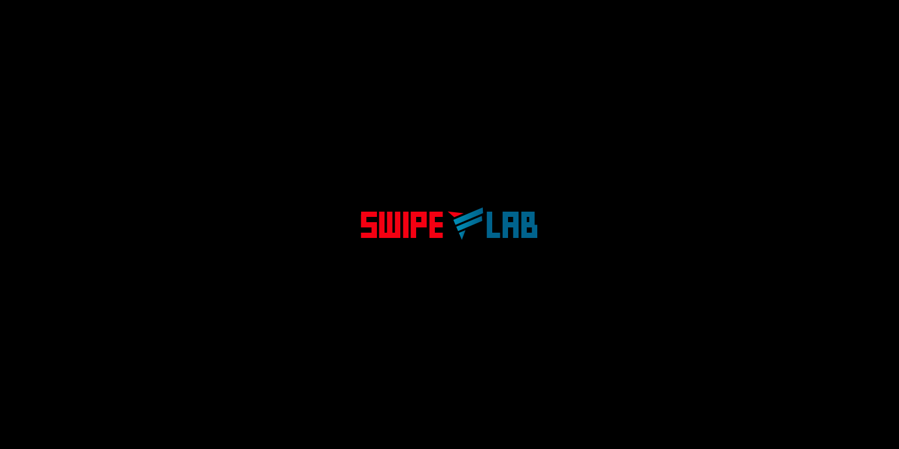

# sx for Visual Studio Code

Language support for the [sx programming language](https://git.swipelab.com/lab/sx).

## Features

- **Syntax highlighting** for `.sx` files, including embedded GLSL, SQL, HTML, and JSON blocks.
- **Language server integration** — the extension launches the `sx` binary's language server (`sx lsp`) to provide editor intelligence.
- **Breakpoints** registered for the `sx` language.

## Requirements

The `sx` compiler must be installed and on your `PATH` (or point the extension at it via the setting below). The extension shells out to it for the language server.

## Settings

| Setting | Default | Description |
|---------|---------|-------------|
| `sx.lspPath` | `sx` | Path to the `sx` binary used to start the language server (`sx lsp`). |

## License

[MIT](LICENSE) © agra
